[](/LICENSE)
[](https://github.com/bcgov/repomountie/blob/master/doc/lifecycle-badges.md)
[](https://github.com/bcgov/quickstart-openshift/actions/workflows/merge.yml)
[](https://github.com/bcgov/quickstart-openshift/actions/workflows/analysis.yml)
[](https://github.com/bcgov/quickstart-openshift/actions/workflows/scheduled.yml)

# 🚀 QuickStart for OpenShift

## 🔄 Pull Request-Based Workflows with Sample Stack

This repository provides a template to rapidly deploy a modern web application stack to OpenShift using [GitHub Actions](https://github.com/bcgov/quickstart-openshift/actions), incorporating best practices for CI/CD, security, and observability.  By hitting the ground running we can save weeks-to-months of development time plus receive regular updates and features.

**Includes:**
* 🔄 Pull Request-based pipeline
* 🏖️ Sandboxed development environments
* 🔒 Gated/controlled production deployments (optional)
* 📦 Container publishing (ghcr.io) and importing (OpenShift)
* 🛡️ Security, vulnerability, infrastructure, and container scan tools
* 🔧 Automatic dependency patching available from [bcgov/renovate-config](https://github.com/bcgov/renovate-config)
* ✅ Enforced code reviews and workflow jobs (pass|fail)
* 📊 OpenShift Templates
* 📈 Prometheus Metrics export from BFF/Frontend
* ⚡ Resource Tuning with Horizontal Pod Autoscaler
* 🎯 Affinity and anti-affinity for Scheduling on different worker nodes
* 🔄 Rolling updates with zero downtime in PROD
* 🗃️ Database Migrations with Flyway
* 🛡️ Pod disruption budgets for high availability
* 🔍 Self-healing through probes/checks (startup, readiness, liveness)
* 🎯 Point the long-lived DEMO route to PRs by using the `demo` label
* **Sample application stack:**
    * 🗄️ Database: Postgres, Flyway
    * 🎨 Frontend: TypeScript, Caddy Server with Coraza WAF
    * ⚙️ BFF: TypeScript, Nest.js
    * 🔄 Alternative backend examples - see [Alternative Backends](#alternative-backends)

# ⚙️ Setup

Initial setup is intended to take an hour or less.  This depends greatly on intended complexity, features selected/excluded and outside cooperation.

## Widgets API OpenAPI Validation

The reference implementation now separates the UI/BFF surface from the provider surface:

- `bff`: backend-for-frontend (BFF) used by the browser UI. It starts Authorization Code with PKCE login, exchanges the code with a confidential client, maintains an HttpOnly session cookie, and proxies Widget requests to `provider-sdx-api`.
- `provider-sdx-api`: SDX-facing provider API used by the BFF. It derives Widget ownership from the JWT `sub` claim and proxies adapted requests to the provider API.
- `provider-api`: non-SDX-facing provider API. It identifies Widget ownership from explicit subject path/body parameters and is not called directly by the UI.

Validate the OpenAPI 3.0.3 contracts locally with:

```sh
cd provider-sdx-api
npm run lint:openapi

cd ../provider-api
npm run lint:openapi
```

The SDX-facing API keeps the SDX OAuth scope checks from the
[Connected Services Integration Toolkit API Governance Style Guide](https://github.com/bcgov/csit-api-governance-spectral-style-guide/blob/main/dist/spectral/STRICT_STYLE_GUIDE.md).
The internal provider API uses the same base ruleset with the SDX OAuth-scope
requirement disabled because it is not an SDX-facing contract.

## Widgets API Local Development

The internal provider API uses the existing PostgreSQL/Flyway/Prisma approach from this template. The SDX-facing provider API does not connect to the database; it derives the owner subject from the JWT and proxies adapted requests to the internal provider API. The BFF also does not connect to the database; it stores local development sessions in memory and proxies Widget requests with the user access token from the server-side session.

Use Node.js 22.13 or newer for API commands. The repo includes `.nvmrc`, so with nvm you can run:

```sh
nvm use
```

Start the local database, migrations, provider APIs, BFF, and frontend with:

```sh
HOST_UID=$(id -u) HOST_GID=$(id -g) docker compose up database migrations provider-api provider-sdx-api bff frontend
```

`HOST_UID` and `HOST_GID` make the bind-mounted Node services write generated
local files as your host user instead of as a container user such as `root` or
`nobody`.

The BFF is exposed on `http://localhost:3001`, with auth routes under `/api/auth` and proxied Widget routes under `/api/v1`.
The SDX-facing provider API is exposed on `http://localhost:3003`, with API routes under `/api/v1`. Swagger UI is available at `http://localhost:3003/api/docs`.
The internal provider API is exposed on `http://localhost:3002`, with API routes under `/api/v1`. Swagger UI is available at `http://localhost:3002/api/docs`.
The frontend is exposed on `http://localhost:3000` and calls the BFF through same-origin `/api` paths.

### Local Keycloak configuration

The BFF uses the OIDC authorization code flow with PKCE. For local development,
configure Keycloak with the included Admin REST API script before starting the
stack. The script defaults to the `local` environment:

See [KEYCLOAK_OIDC_SETUP.md](KEYCLOAK_OIDC_SETUP.md) for the complete Keycloak
realm, client, token, and BFF validation configuration.

```sh
node scripts/setup-keycloak.mjs \
  --url https://authz-b8840c-dev.apps.gold.devops.gov.bc.ca/auth \
  --realm sdx \
  --admin-username "<admin-username>" \
  --admin-password "<admin-password>"
```

The script creates or updates OAuth clients and Widget scopes using the
Keycloak Admin REST API, then writes the generated client IDs and client secrets
to `.env.<environment>`. Docker Compose reads `.env` by default, so copy or
rename the generated file to `.env`, or pass it with `docker compose --env-file`.
The admin password is not written to disk.

Use a different environment name to change the generated client ID prefix and
output file:

```sh
node scripts/setup-keycloak.mjs \
  --url https://authz-b8840c-dev.apps.gold.devops.gov.bc.ca/auth \
  --realm sdx \
  --admin-username "<admin-username>" \
  --admin-password "<admin-password>" \
  --environment dev \
  --frontend-origin https://<frontend-host> \
  --provider-api-public-url https://<provider-api-host> \
  --provider-sdx-api-public-url https://<provider-sdx-api-host-or-path>
```

Or provide exact client IDs:

```sh
node scripts/setup-keycloak.mjs \
  --url https://authz-b8840c-dev.apps.gold.devops.gov.bc.ca/auth \
  --realm sdx \
  --admin-username "<admin-username>" \
  --admin-password "<admin-password>" \
  --bff-client-id "<bff-client-id>" \
  --provider-service-client-id "<service-client-id>" \
  --provider-api-swagger-client-id "<provider-api-swagger-client-id>" \
  --provider-sdx-api-swagger-client-id "<provider-sdx-api-swagger-client-id>"
```

Then start the stack:

```sh
HOST_UID=$(id -u) HOST_GID=$(id -g) docker compose --env-file .env.local up database migrations provider-api provider-sdx-api bff frontend
```

The script configures these local clients:

- `local-widget-bff`: confidential BFF client with callback `http://localhost:3000/api/auth/callback`
- `local-provider-sdx-api`: confidential service client used by `provider-sdx-api` to call `provider-api`
- `local-provider-api-swagger`: public Swagger UI client with callback `http://localhost:3002/api/docs/oauth2-redirect.html`
- `local-provider-sdx-api-swagger`: public Swagger UI client with callback `http://localhost:3003/api/docs/oauth2-redirect.html`

The browser starts login at `/api/auth/login`, the BFF receives the callback at
`/api/auth/callback`, exchanges the authorization code server-side, and then
sets the HttpOnly session cookie before redirecting back to the UI.

DEV uses:

- UI: `https://widgets-apps-gov-bc-ca.dev.api.gov.bc.ca`
- Browser API base path: `/api/v1`
- Frontend proxy target: internal BFF service URL

The BFF accepts these runtime settings:

| Variable | Required | Default | Description |
| --- | --- | --- | --- |
| `OIDC_AUTHORITY` | Yes | | OIDC issuer/authority URL |
| `BFF_OIDC_CLIENT_ID` | Yes | Generated by setup script | Confidential BFF client ID |
| `BFF_OIDC_CLIENT_SECRET` | Yes | | Confidential BFF client secret used for token exchange |
| `BFF_OIDC_SCOPE` | Yes | Generated by setup script | Space-delimited scopes requested for the user token |
| `BFF_OIDC_DISPLAY_NAME_CLAIM` | No | `name` | Dot-delimited display-name claim path |
| `BFF_OIDC_REDIRECT_URI` | Yes | Generated by setup script | BFF login callback URI |
| `OIDC_OPENID_CONNECT_URL` | No | `<OIDC_AUTHORITY>/.well-known/openid-configuration` | Explicit discovery URL |
| `PROVIDER_SDX_API_BASE_URL` | No | `http://provider-sdx-api:3000/api/v1` | SDX-facing provider API base URL |
| `BFF_PUBLIC_BASE_PATH` | No | | Preserved public path prefix before `/api`, if the BFF is mounted below a path |

The provider API service-to-service connection accepts these runtime settings:

| Variable | Required | Default | Description |
| --- | --- | --- | --- |
| `PROVIDER_API_ALLOWED_CLIENT_IDS` | Yes | Generated by setup script | Comma-delimited client IDs that `provider-api` accepts as service clients |
| `PROVIDER_API_BASE_URL` | No | `http://provider-api:3000/api/v1` | Internal provider API base URL used by `provider-sdx-api` |
| `PROVIDER_SDX_API_CLIENT_ID` | Yes | Generated by setup script | Confidential service client ID used by `provider-sdx-api` |
| `PROVIDER_SDX_API_CLIENT_SECRET` | Yes | | Confidential service client secret used for client-credentials token requests |
| `PROVIDER_SDX_API_TOKEN_SCOPE` | No | | Optional scopes requested on the client-credentials token |
| `PROVIDER_SDX_API_TOKEN_URL` | No | OIDC discovery `token_endpoint` | Explicit token endpoint for service-token requests |
| `PROVIDER_API_PUBLIC_BASE_PATH` | No | | Preserved public path prefix before `/api` for `provider-api` |
| `PROVIDER_SDX_API_PUBLIC_BASE_PATH` | No | | Preserved public path prefix before `/api` for `provider-sdx-api`, for example `/sdx` |

Both provider APIs accept JWT validation flags:

| Variable | `provider-api` default | `provider-sdx-api` default | Description |
| --- | --- | --- | --- |
| `JWT_VALIDATE_SIGNATURE` | `true` | `false` | Verify JWT signature using OIDC discovery `jwks_uri` |
| `JWT_VALIDATE_EXPIRY` | `true` | `false` | Require a non-expired numeric JWT `exp` claim |
| `JWT_ISSUER` | `PROVIDER_API_JWT_ISSUER`, generated from `OIDC_AUTHORITY` | unset | Expected issuer; when set, the JWT `iss` claim must match |

Signing keys are resolved from the configured `OIDC_OPENID_CONNECT_URL`, or from
the discovery document derived from `OIDC_AUTHORITY`. `JWT_ISSUER` only controls
issuer comparison. The services do not trust the token's unvalidated `iss` claim
to choose a JWKS URL.

In Docker Compose, use `PROVIDER_API_JWT_VALIDATE_SIGNATURE`,
`PROVIDER_API_JWT_VALIDATE_EXPIRY`, and `PROVIDER_API_JWT_ISSUER` to configure
the provider API validation. Use `PROVIDER_SDX_API_JWT_VALIDATE_SIGNATURE`,
`PROVIDER_SDX_API_JWT_VALIDATE_EXPIRY`, and `PROVIDER_SDX_API_JWT_ISSUER` to
configure the SDX-facing provider API validation.

Provider Swagger UI can be configured with an OAuth public client for either
provider API. Set `PROVIDER_API_SWAGGER_OAUTH_CLIENT_ID` for `provider-api` and
`PROVIDER_SDX_API_SWAGGER_OAUTH_CLIENT_ID` for `provider-sdx-api`. Docker
Compose requires the service-specific Swagger variables generated by the setup
script. When a Swagger OAuth client is configured, the API uses
`OIDC_OPENID_CONNECT_URL`, or derives
`<authority>/.well-known/openid-configuration` from `OIDC_AUTHORITY`, to load
authorization and token endpoints. Set the matching
`*_SWAGGER_OAUTH_REDIRECT_URL` to the absolute callback URL registered with that
public client. Do not configure a client secret. `*_SWAGGER_OAUTH_SCOPES`
controls the space-delimited scopes requested by Swagger.

If an API is mounted behind a preserved route path, set the matching
`*_PUBLIC_BASE_PATH` so the service actually serves its API and Swagger routes
under that prefix and publishes the right same-origin OpenAPI server URL. For
example, when `provider-sdx-api` is exposed at
`https://widgets-api-gov-bc-ca.dev.api.gov.bc.ca/sdx`, set
`PROVIDER_SDX_API_PUBLIC_BASE_PATH=/sdx` and register the Swagger callback as
`https://widgets-api-gov-bc-ca.dev.api.gov.bc.ca/sdx/api/docs/oauth2-redirect.html`.

`provider-sdx-api` sends adapted requests to `provider-api` using
`PROVIDER_API_BASE_URL`. Docker Compose defaults this to
`http://provider-api:3000/api/v1`. For non-Docker local runs, set it to the
provider API origin, for example `http://localhost:3002/api/v1`.
`provider-sdx-api` authenticates to `provider-api` by obtaining a real
client-credentials access token for the service client. There is no static
bearer-token override and no unsigned local development token fallback. It also
sends `x-on-behalf-of-sub` and `x-on-behalf-of-username` headers for the
original user. `provider-api` accepts client tokens only from
`PROVIDER_API_ALLOWED_CLIENT_IDS` and requires those on-behalf-of headers for
client-token requests.

The internal provider API records Widget access events in
`widgets.widget_access_events` with the owner subject, actor subject, actor
username, event type, human-readable description, relative resource URL, and
timestamp. It also upserts the represented user in `widgets.users`: for
service-client calls it uses the `x-on-behalf-of-sub` and
`x-on-behalf-of-username` headers, and for direct user-token calls it uses the
JWT claims.

Widget list endpoints return `WidgetSummary` items with only identifier, owner,
name, status, and updated timestamp. Fetching `/widgets/{widgetId}` returns the
full Widget resource, including description and additional data, and records a
`widget.get` viewed event.

Provider API callers can list audit events for an owner with
`GET /api/v1/subjects/{subject}/events`. The `x-on-behalf-of-sub` and
`x-on-behalf-of-username` headers are required only when the bearer token is a
client token. Swagger users authenticated with an Authorization Code token can
omit those headers.

Register the Swagger callback and API origin with each public OIDC client you
configure:

- Provider API callback: `http://localhost:3002/api/docs/oauth2-redirect.html`
- Provider SDX API callback: `http://localhost:3003/api/docs/oauth2-redirect.html`
- Web origin: `<API origin>`

For a DEV deployment where both provider APIs share a host and the SDX-facing
API is mounted below `/sdx`, use:

- Provider API callback: `https://widgets-api-gov-bc-ca.dev.api.gov.bc.ca/api/docs/oauth2-redirect.html`
- Provider SDX API callback: `https://widgets-api-gov-bc-ca.dev.api.gov.bc.ca/sdx/api/docs/oauth2-redirect.html`
- Web origin for both Swagger clients: `https://widgets-api-gov-bc-ca.dev.api.gov.bc.ca`

The Caddy image serves `/api/v1` from `/config.json` as the same-origin browser
API path and proxies `/api` to `BFF_BASE_URL`. Vite development uses the same
browser path and proxies `/api` to `BFF_BASE_URL`.

The browser does not store access tokens or send bearer tokens. It sends the BFF
session cookie on same-origin API requests. The BFF forwards the session access
token to `provider-sdx-api`, which derives Widget ownership from the JWT `sub`
claim. The frontend currently supports owner access only through the signed-in
subject and calls only the BFF Widget API.

The internal provider API validates JWT signature, issuer, and expiry by
default. The SDX-facing provider API defaults to decoding JWTs without
validation so it can sit behind an SDX gateway during development, but the same
validation flags can be enabled when it is exposed without a validating gateway.
Do not expose the non-SDX provider API directly to browser clients.

Example request:

```sh
curl \
  --cookie "bff_session=${BFF_SESSION_COOKIE}" \
  http://localhost:3000/api/v1/widgets
```

Run API tests with Node 22 or newer:

```sh
cd provider-sdx-api
npm run test

cd ../provider-api
npm run test
```

Future SDX examples intentionally left as TODOs:

- Token exchange
- Delegation tokens
- Signed JWT confidential client authentication
- Event publishing
- Webhook subscriptions
- Policy engine and policy enforcement examples

## ✅ Prerequisites

The following are required for all users:

- [ ] 🐙 [GitHub accounts](https://github.com/signup) for all participating team members
- [ ] 🚀 An OpenShift cluster with project namespaces (DEV, TEST, PROD)

### 🏛️ Additional Requirements for BC Government OpenShift

If you're using BC Government's OpenShift platform, you'll also need:

- [ ] 🏛️ BC Government IDIR accounts for anyone submitting requests
- [ ] 👥 Membership in the BCGov GitHub organization
    - Join the bcgov organization using [these instructions](https://developer.gov.bc.ca/docs/default/component/bc-developer-guide/use-github-in-bcgov/bc-government-organizations-in-github/#directions-to-sign-up-and-link-your-account-for-bcgov).
- [ ] 🚀 BCGov OpenShift project namespaces:
    - [BCGov signup](https://registry.developer.gov.bc.ca)

## 📋 Using this Template

Create a new repository using this repository as a template.

* ✅ Verify bcgov/quickstart-openshift is selected under Repository template

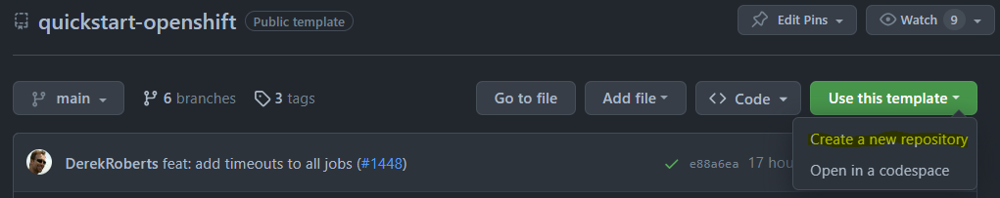

## 🔐 Secrets, Variables and Environments

### 🔑 Secrets and Variables

Variables and secrets are consumed by workflows.  Variables are visible in workflows and logs, while secrets are hidden/redacted.

**Repository-level vs Environment-specific:**

- **Repository-level** (shown as `<none>` in the environment column): These are available to all workflows and environments. They're created at the repository level and apply globally unless overridden by environment-specific values.
- **Environment-specific**: These are scoped to a particular environment (e.g., TEST, PROD) and override repository-level values when that environment is used.

To create new secrets from GitHub.com click:

* `Settings > Secrets and Variables > Actions > Secrets > New repository secret`

Note: Dependabot, which we don't recommend as highly as Renovate, requires its own set of values.

### 🌍 Environments

Environments are groups of secrets and variables with optional access controls.  This includes limiting access to certain users or requiring manual approval before a requesting workflow can run.  Environment values add to or override any repository-level values.

To create new environments from GitHub.com click:

* `Settings > Environments > New environment`

Environments provide a [number of features](https://docs.github.com/en/actions/deployment/targeting-different-environments/using-environments-for-deployment), including:

* Required reviewers
* Wait timer
* Limit TEST/PROD values to post-merge workflows

### 📊 Example

Here is the arrangement of secrets, variables and environments for this repository.

| Environment | Name                   | Description                                    |
|-------------|------------------------|------------------------------------------------|
| \<none\>    | `vars.oc_server`       | Common server address (repository-level)       |
| \<none\>    | `secrets.oc_namespace` | DEV namespace (repository-level)               |
| \<none\>    | `secrets.oc_token`     | DEV service token (repository-level)           |
| TEST        | `secrets.oc_namespace` | TEST namespace (overrides repository-level)     |
| TEST        | `secrets.oc_token`     | TEST service token (overrides repository-level) |
| PROD        | `secrets.oc_namespace` | PROD namespace (overrides repository-level)    |
| PROD        | `secrets.oc_token`     | PROD service token (overrides repository-level) |

### 🔐 Secret Values

**`OC_TOKEN`** 🎫

Create separate tokens for each of the DEV, TEST and PROD namespaces.  

1. Login to your OpenShift console, e.g. [Silver](https://console.apps.silver.devops.gov.bc.ca/) or [Gold](https://console.apps.gold.devops.gov.bc.ca/).
1. Select the pulldown with your username in the top right corner.
1. Select `Copy login command`.
1. Follow the UI to access a one-time login with token.
1. Paste the login command into a shell, e.g.:
    ```
    oc login --token=... --server=...
    ```
1. View available projects:
    ```
    oc projects
    ```
1. Switch to a namespace:
    ```
    oc project <abc123-name>
    ```
1. Create a service account:
    ```
    oc create sa github-actions
    ```
1. Create a role binding:
    ```
    oc create rolebinding github-actions-edit --clusterrole=edit --serviceaccount=$(oc project -q):github-actions
    ```
1. Create and copy a token.  It cannot be retrieved again:
    ```
    oc create token github-actions --duration=87600h
    ```

* Alternate steps using an inline template can be found [here](https://github.com/bcgov/gh-discussions-lab/discussions/3750). 
* In earlier versions of OpenShift, a pipeline token secret was created automatically in each namespace. 
* Reference: `{{ secrets.oc_token }}`

**`OC_NAMESPACE`** 📁

Teams will receive a set of project namespaces, usually DEV (for PRs), TEST and PROD.  TOOLS namespaces (e.g. Jenkins, shared Oracle resources) are not used here.  Provided by your OpenShift platform team.

* Reference: `{{ secrets.oc_namespace }}`
* E.g.: `abc123-dev`

**`SONAR_TOKEN(s)`** 📊

If SonarCloud is being used each application will have its own token.  Single-application repositories typically use `SONAR_TOKEN`, while monorepos append component names.

* Reference (standalone): `${{ secrets.SONAR_TOKEN }}`
* Reference (monorepo): `${{ secrets.SONAR_TOKEN_BACKEND }}`, `${{ secrets.SONAR_TOKEN_FRONTEND }}`, etc

BC Government employees can request SonarCloud projects by creating an [issue](https://github.com/bcgov/devops-requests/issues/new/choose) with the platform team.  Please make sure to request a monorepo with component names (e.g. bff, frontend), which may not be explained in their directions.

### 📊 Variable Values

> 👆 Click Settings > Secrets and Variables > Actions > Variables > New repository variable

**`OC_SERVER`** 🌐

OpenShift server address (API endpoint for your OpenShift cluster).
* Reference: `{{ vars.oc_server }}`
* BCGov: `https://api.gold.devops.gov.bc.ca:6443` or `https://api.silver.devops.gov.bc.ca:6443`
* Others: Use your cluster's API server address (e.g. `https://api.<cluster-domain>:6443`)

## 🔄 Updating Dependencies

Dependabot and Mend Renovate can both provide dependency updates using pull requests.  Dependabot is simpler to configure, while Renovate is much more configurable and lighter on resources.

### 🤖 Renovate

A config file (`renovate.json`) is included with this template.  It can source config from our [renovate repository](https://github.com/bcgov/renovate-config).  Renovate can be [self-hosted](https://github.com/renovatebot/github-action) or run using the GitHub App managed at the organization level.  For BC Government the OCIO controls this application, so please opt in with them using a GitHub issue.

To opt-in:
* Visit the [Renovate GitHub App](https://github.com/apps/renovate/)
* Click `Configure` and set up your repository
* Visit [BCDevOps Requests](https://github.com/BCDevOps/devops-requests)
* Select [Issues](https://github.com/BCDevOps/devops-requests/issues)
* Select [New Issue](https://github.com/BCDevOps/devops-requests/issues/new/choose)
* Select [Request for integrating a GitHub App](https://github.com/BCDevOps/devops-requests/issues/new?assignees=MonicaG%2C+oomIRL%2C+SHIHO-I&labels=github-app%2C+pending&projects=&template=github_integration_request.md&title=)
* Create a meaningful title, e.g. `Request to add X repo to Renovate App`
* Fill out the description providing a repository name
* Select "Submit new issue"
* Wait for Renovate to start sending pull requests to your repository

### 🔧 Dependabot

Dependabot is no longer recommended as an alternative to Renovate for generating security, vulnerability and dependency pull requests.  It can still be used to generate warnings under the GitHub Security tab, which is only viewable by repository administrators.

## 🔍 Dependency Scanning with Knip

This repository uses [Knip](https://knip.dev/) for dependency scanning to identify unused dependencies and exports. Knip runs automatically as part of the Analysis workflow via the `bcgov/action-test-and-analyse` action.

**Note:** As a template repository, Knip runs in **warning mode** (non-blocking) to allow teams to customize dependencies without build failures. Teams can optionally change `dep_scan: warning` to `dep_scan: error` in their forks to enforce dependency scanning as a blocking check.

### 📋 Handling Unused Dependencies

When Knip identifies unused dependencies, you have two options:

1. **Remove the dependency** - If it's truly unused, remove it from `package.json`
2. **Report as false positive** - If the dependency is used but not detected by static analysis

### 🚫 Reporting False Positives

**Do not create team-specific `knip.config.ts` files.** All Knip configuration is managed centrally in the upstream action repository.

If you encounter a false positive (a dependency that is used but flagged as unused), report it upstream:

1. **Verify it's a false positive** by checking:
   - Is it exported from a utility file (e.g., `test-utils.tsx`)?
   - Is it used via dynamic imports?
   - Is it required by build tools or other dependencies?
   - Is it used in configuration files that Knip doesn't analyze?

2. **Open a PR to the upstream repository:**
   - Repository: [`bcgov/action-test-and-analyse`](https://github.com/bcgov/action-test-and-analyse)
   - File: `.knip.json`
   - Add the dependency to the `ignoreDependencies` array

3. **Include justification** in your PR:
   - Why it's a false positive
   - How the dependency is used
   - Example: "Exported from test-utils files for use in tests but may not be directly imported yet. Common pattern in testing utilities."

### 📝 Example: Reporting a False Positive

If `@testing-library/user-event` is flagged but exported from `test-utils.tsx`:

**Upstream PR to `bcgov/action-test-and-analyse/.knip.json`:**
```json
{
  "ignoreDependencies": [
    "swagger-ui-express",
    "rimraf",
    "@types/node",
    "@types/react",
    "@types/react-dom",
    "@testing-library/user-event"
  ],
  "ignoreBinaries": [
    "rimraf"
  ]
}
```

**PR Description:**
> Add `@testing-library/user-event` to ignoreDependencies
> 
> This dependency is exported from test-utils files for use in tests but may not be directly imported yet. This is a common pattern in testing utilities where dependencies are re-exported for convenience.

### ✅ Common False Positive Patterns

- **Exported APIs**: Dependencies exported from utility files (like `test-utils.tsx`) that are intended for use but may not be directly imported yet
- **Indirect usage**: Dependencies used by build tools, scripts, or other dependencies that static analysis can't detect
- **Dynamic imports**: Dependencies loaded via dynamic imports or string-based requires
- **Configuration files**: Dependencies used in config files that aren't detected by static analysis
- **Type-only imports**: TypeScript type-only imports that are stripped at runtime

## ⚙️ Repository Configuration

### 🔀 Pull Request Handling

Squash merging is recommended for simplified history and ease of rollback.  Cleaning up merged branches is recommended for your DevOps Specialist's fragile sanity.

> Click Settings > General (selected automatically)

Pull Requests:

* `[uncheck] Allow merge commits`
* `[check] Allow squash merging`
   * `Default to pull request title`
* `[uncheck] Allow rebase merging`
* `[check] Always suggest updating pull request branches`
* `[uncheck] Allow auto-merge`
* `[check] Automatically delete head branches`

### 📦 Packages

Packages are available from your repository (link on right).  All should have visibility set to public for the workflows to run successfully.

E.g. https://github.com/bcgov/quickstart-openshift/packages

### 🛡️ Branch Protection Rules

This is required to prevent direct pushes and merges to the default branch.  These steps must be run after one full pull request pipeline has been run to populate the required status checks.

1. Select `Settings` (gear, top right) > `Rules` > `Rulesets` (under Code and Automation)
2. Click `New ruleset` > `New branch ruleset`
3. Setup Ruleset:
    * Ruleset Name: `main`
    * Enforcement status: `Active`
    * Bypass list:
        * Click `+ Add bypass`
        * Check `[x] Repository admin`
        * Click `Add selected`
    * Target branches:
        * Click `Add target`
        * Select `Include default branch`
    * Branch protections:
        * `[x] Restrict deletions`
        * `[x] Require linear history`
        * `[x] Require a pull request before merging`
            * Additional settings:
                * `Require approvals: 1` (or more!)
                * `[x] Require conversation resolution before merging`
        * `[x] Require status checks to pass`
            * `[x] Require branches to be up to date before merging`
            * Required checks: *These will be populated after a full pull request pipeline run!*
                * Click `+Add checks`
                * This is our default set, yours may differ:
                    * `Analysis Results`
                    * `PR Results`
                    * `Validate Results`
    * `[x] Block force pushes`
    * `[x] Require code scanning results`
        * Click `+ Add tool`
        * This is our default set, yours may differ:
            * `CodeQL`
            * `Trivy`
    * Click `Create`

Note: Required status checks will only be available to select after the relevant workflows have run at least once on a pull request.

#### Status checks example
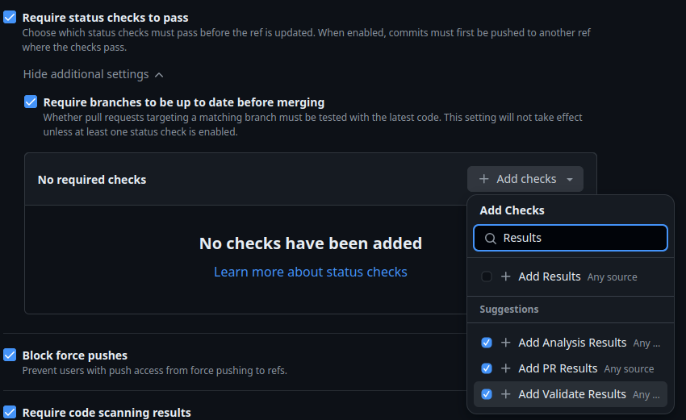

#### Required tools and alerts example
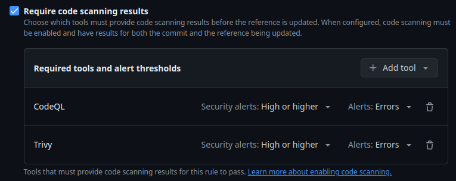


### 👥 Adding Team Members

Don't forget to add your team members!  

1. ⚙️ Select Settings (gear, top right)  *> Collaborators and teams (under `Access`)
2. 👆 Click `Add people` or `Add teams`
3. 🔍 Use the search box to find people or teams
4. 🎭 Choose a role (read, triage, write, maintain, admin)
5. ➕ Click Add

# 🔄 Workflows

These workflows and actions enforce a pull request based flow.
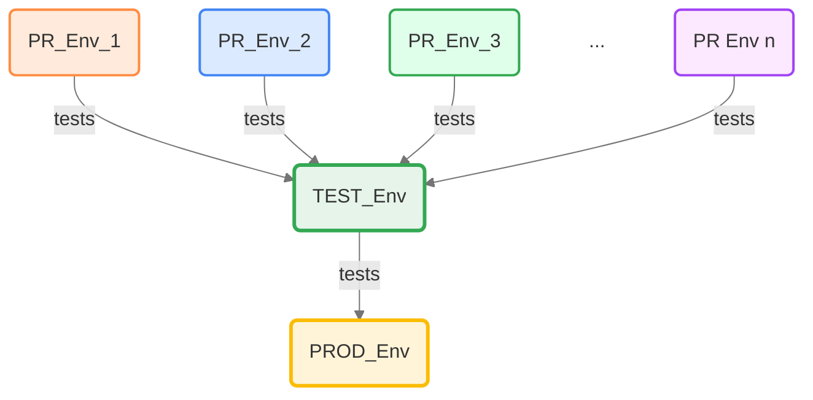

Here's a more detailed view showing a single pull request.

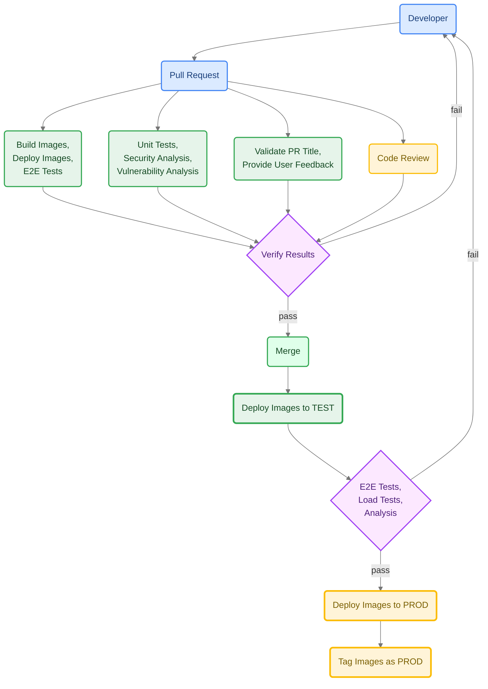

## 🔀 Pull Request

Runs on pull request submission.

* 🏖️ Provides safe, sandboxed deployment environments
* 🏗️ Build action pushes to GitHub Container Registry (ghcr.io)
* 🔄 Build triggers select new builds vs reusing builds
* 🚀 Deploy only when changes are made
* 📋 Deployment includes curl checks and optional penetration tests
* 🧪 Run tests (e2e, load, integration) when changes are made
* ✅ Other checks and updates as required

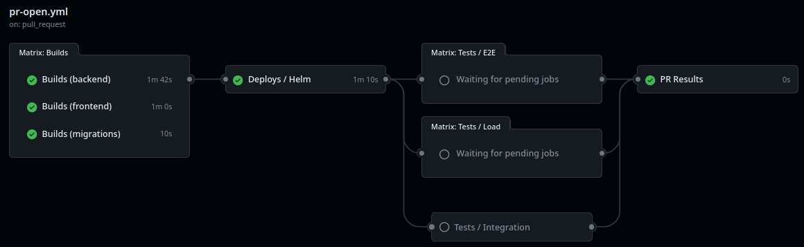

## ✅ Validation

Runs on pull request submission.

* 📋 Enforces conventional commits in PR title
* 👋 Adds greetings/directions to PR descriptions

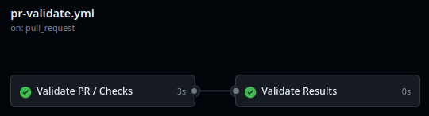


## 📊 Analysis

Runs on pull request submission or merge to the default branch.

* 🧪 Unit tests (should include coverage)
* 🔍 CodeQL/GitHub security reporting (now handled as GitHub default!)
* 🛡️ Trivy password, vulnerability and security scanning

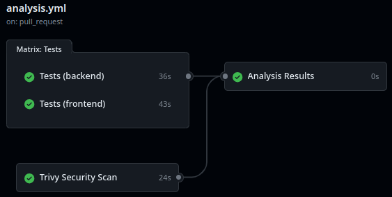

## ❌ Pull Request Closed

Runs on pull request close or merge.

* 🧹 Cleans up OpenShift objects/artifacts
* 🏷️ Merge retags successful build images as `latest`

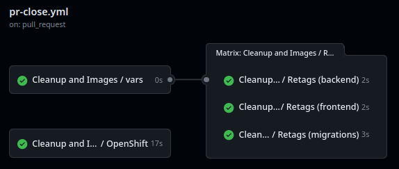

## 🔗 Merge

Runs on merge to main branch.

* 🔍 Code scanning and reporting to GitHub Security overview
* 🚀 Zero-downtime* TEST deployment
* 🛡️ Penetration tests on TEST deployment (optional)
* 🚀 Zero-downtime* PROD deployment
* 🏷️ Labels successful deployment images as PROD

\* excludes database changes

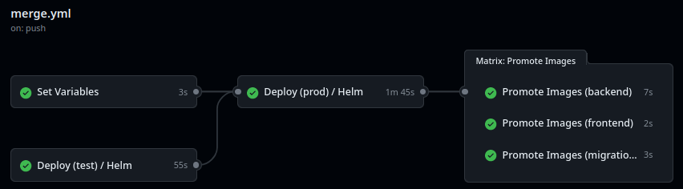

## ⏰ Scheduled

Runs on scheduled job (cronjob) or workflow dispatch.

* 🧹 PR environment purge
* 📚 Generate SchemaSpy documentation
* 🧪 Tests (e2e, load, integration) on TEST deployment

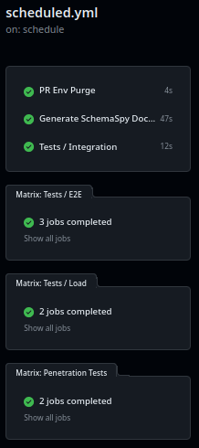

## 🎯 DEMO Routing

There is a long-lived custom route available to be assigned to specific Pull Request deployments.  Add the label `demo` to that pull request or run the `DEMO Route` workflow.

Typical route format: `https://<REPO_NAME>-demo.<your-openshift-domain>`  
Example (BCGov): `https://<REPO_NAME>-demo.apps.silver.devops.gov.bc.ca`

#### 🏷️ PR Label

Please note that the label must be manually created using GitHub's web interface.

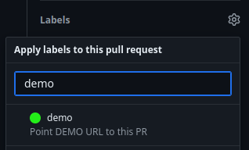

#### ⚙️ Workflow


# 📚 App Stack

**Frontend (JavaScript/TypeScript)** 🎨

[](https://sonarcloud.io/summary/new_code?id=quickstart-openshift_frontend)
[](https://sonarcloud.io/summary/new_code?id=quickstart-openshift_frontend)
[](https://sonarcloud.io/summary/new_code?id=quickstart-openshift_frontend)
[](https://sonarcloud.io/summary/new_code?id=quickstart-openshift_frontend)
[](https://sonarcloud.io/summary/new_code?id=quickstart-openshift_frontend)
[](https://sonarcloud.io/summary/new_code?id=quickstart-openshift_frontend)
[](https://sonarcloud.io/summary/new_code?id=quickstart-openshift_frontend)
[](https://sonarcloud.io/summary/new_code?id=quickstart-openshift_frontend)
[](https://sonarcloud.io/summary/new_code?id=quickstart-openshift_frontend)

**BFF (JavaScript/TypeScript)** ⚙️

[](https://sonarcloud.io/summary/new_code?id=quickstart-openshift_backend)
[](https://sonarcloud.io/summary/new_code?id=quickstart-openshift_backend)
[](https://sonarcloud.io/summary/new_code?id=quickstart-openshift_backend)
[](https://sonarcloud.io/summary/new_code?id=quickstart-openshift_backend)
[](https://sonarcloud.io/summary/new_code?id=quickstart-openshift_backend)
[](https://sonarcloud.io/summary/new_code?id=quickstart-openshift_backend)
[](https://sonarcloud.io/summary/new_code?id=quickstart-openshift_backend)
[](https://sonarcloud.io/summary/new_code?id=quickstart-openshift_backend)
[](https://sonarcloud.io/summary/new_code?id=quickstart-openshift_backend)

## 🚀 Starter

The starter stack includes a frontend (React, Bootstrap, Vite, Caddy), BFF (Nest/Node) and Postgres or PostGIS database.  See subfolder for source, including Dockerfiles and OpenShift templates.  Alternative backends are available.

**Features:**
* 💪 [TypeScript](https://www.typescriptlang.org/) strong-typing for JavaScript
* 🏗️ [NestJS](https://docs.nestjs.com) Nest/Node BFF and frontend
* 🔄 [Flyway](https://flywaydb.org/) database migrations
* 🐘 [Postgres](https://www.postgresql.org/) Database
* 🛡️ [OWASP Coraza WAF](https://github.com/corazawaf/coraza-caddy) Web Application Firewall integrated with Caddy

Postgres is enabled by default for the application stack. Use the OpenShift templates in the `database/` folder to manage the deployment.

### 🛡️ OWASP Coraza WAF: Application Security

[OWASP Coraza](https://coraza.io/) is an open-source Web Application Firewall (WAF) that provides application-layer security protection against common web attacks. As part of the OWASP (Open Web Application Security Project) ecosystem, Coraza can be used alongside other OWASP security tools. For example, [OWASP ZAP](https://www.zaproxy.org/) (Zed Attack Proxy) is a security testing and validation tool that can be used to test applications protected by Coraza, though there is no special integration between them.

**Why Coraza WAF is Important:**

Coraza WAF acts as a security shield for your application, protecting against:
- **SQL Injection (SQLi)** attacks that attempt to manipulate database queries
- **Cross-Site Scripting (XSS)** attacks that inject malicious scripts into web pages
- **Path Traversal** attempts to access unauthorized files or directories
- **Security Scanner** probes from automated attack tools
- **Sensitive Path** access attempts (e.g., `.env`, `.git`, admin panels)

The WAF is integrated directly into the Caddy web server, providing real-time protection with minimal performance overhead. It uses pattern-based rules and operators (such as regular expressions and string matching) to identify and block malicious requests before they reach your application.

**Customization & Troubleshooting:**

**1. Modifying WAF Rules**
- WAF rules are defined in `frontend/coraza.conf`.
- Edit this file to add, remove, or adjust rules. For example, to allow a specific request method, modify or comment out the relevant rule.
- After making changes, restart the frontend service using Docker Compose:
  ```bash
  docker compose restart frontend
  ```

**2. Viewing WAF Logs**
- WAF logs are typically output to the Caddy logs. When running locally with Docker Compose, check the container logs with:
  ```bash
  docker compose logs frontend
  ```
- Look for entries containing "coraza" or "WAF" to identify blocked requests and rule matches.

**3. Temporarily Disabling the WAF**
- To disable the WAF for testing, comment out or remove the Coraza configuration block in the Caddyfile (usually in `frontend/Caddyfile`).
- Alternatively, you can remove or rename `coraza.conf` and restart the frontend.
- **Warning:** Disabling the WAF exposes your app to threats. Only do this in non-production environments.

**4. Handling False Positives & Whitelisting Legitimate Traffic**
- If legitimate requests are blocked, review the logs to identify which rule triggered the block.
- Adjust or disable the specific rule in `coraza.conf` to whitelist the traffic.
- You can use `SecRuleRemoveById <rule_id>` to disable a rule by its ID.
- Test thoroughly after making changes to ensure security is maintained.

For more details, see the [Coraza documentation](https://coraza.io/docs/).

## 🗄️ PostgreSQL Database

PostgreSQL is the default database for the QuickStart stack.

### 🌟 Key Features
- 💾 Persistent storage with PVCs
- 📊 Monitoring via Prometheus
- 🔧 Self-healing capabilities with probes
- ⚡ Resource Tuning with Horizontal Pod Autoscaler (TEST/PROD only)

### 💡 Setup Tips
1. **⚙️ Resource Allocation**: Adjust the resources in `database/openshift.deploy.yml` based on your application needs.
2. **🌍 Environment Configuration**: Create environment-specific configs from base values as needed.
3. **🚨 DR Testing**: Disaster Recovery Testing is **`MANDATORY`** before go live.


## 🔄 Alternative Backends

The sample Java, Python and Go backends repository has been archived, but we have lots of other great examples of active projects you can learn from!

* [NR-RFC-AlertAuthoring - Python with FastAPI and Alembic](https://github.com/bcgov/nr-rfc-alertauthoring)
* [QuickStart OpenShift Backends](https://github.com/bcgov/quickstart-openshift-backends)

## 📊 SchemaSpy

The database documentation is created and deployed to GitHub pages.  See [here](https://bcgov.github.io/quickstart-openshift/schemaspy/index.html).

After a full workflow run and merge has been completed, please do the following:

1. ⚙️ Select Settings (gear, top right) > Pages (under `Code and automation`)
2. 👆 Click `Branch`
3. 🌿 Select `gh-pages`
4. 💾 Click `Save`

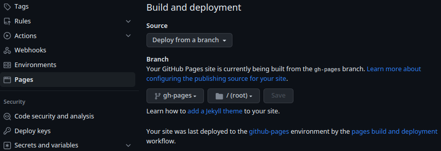

# 🔄 Flyway, Prisma, Migrations
1. 🛠️ [Flyway is used as Database Schema Migration tool](https://www.red-gate.com/products/flyway/community/)
2. 🔧 [Prisma is used as ORM layer](https://www.prisma.io/)
3. 💡 The rationale behind using flyway to have schema first approach and let prisma generate ORM schema from the database, which would avoid pitfalls like lazy loading, cascading, etc. when defining entities in ORM manually.
4. 🐳 Run flyway in the docker compose to apply latest changes to Postgres database.
5. 🔄 Run npx prisma db pull from the provider API folder to sync the prisma schema.
6. ⚙️ Run npx prisma generate to generate the prisma client which will have all the entities populated based on fresh prisma schema.
7. 💻 If using VS Code, be aware of [this issue](https://stackoverflow.com/questions/65663292/prisma-schema-not-updating-properly-after-adding-new-fields)


## 🏗️ Architecture

The architecture diagram provides an overview of the system's components, their interactions, and the deployment structure. It illustrates the relationships between the frontend, BFF, database, and other infrastructure elements within the OpenShift environment.

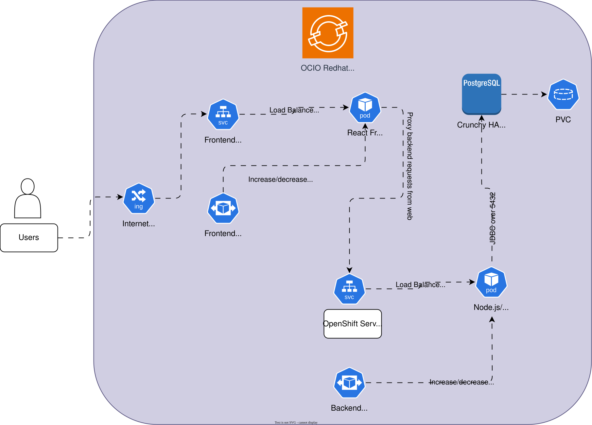

## 🤝 Contributing

We welcome contributions to improve this template! 
Please contribute your ideas!  [Issues](/../../issues) and [Pull Requests](/../../pulls) are appreciated.

**Built with ❤️ by the NRIDS Team**

This repository is provided by NRIDS Architecture and Forestry Digital Services, courtesy of the Government of British Columbia.

* 🚀 NRID's [Kickstarter Guide](https://bcgov.github.io/nr-architecture-patterns-library/docs/Agile%20Team%20Kickstarter) (via. Confluence, links may be internal)
